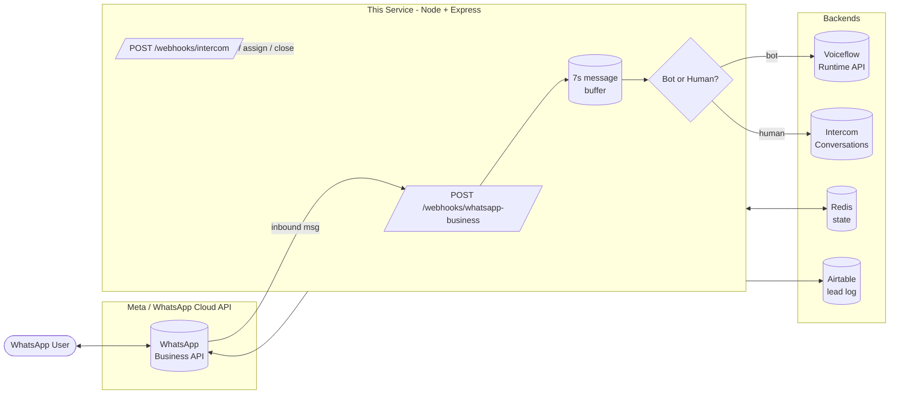
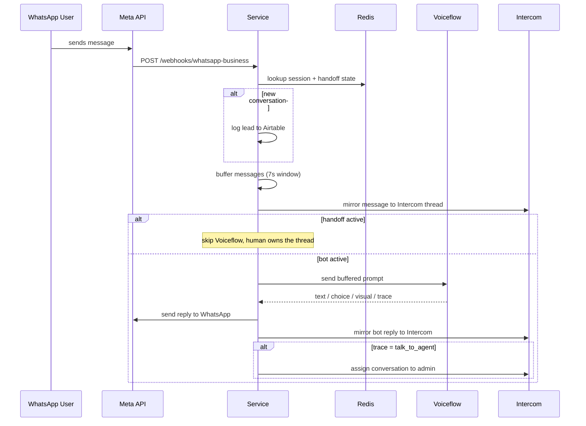
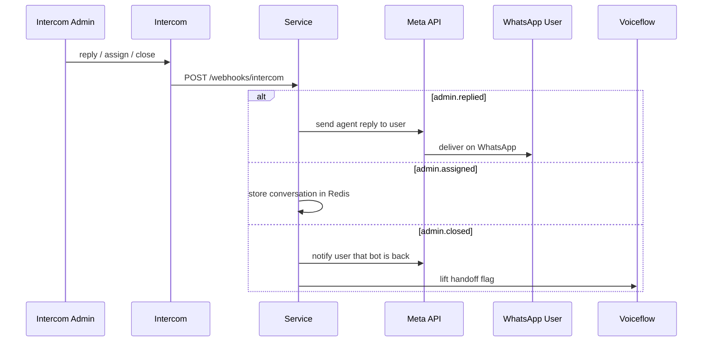

# WhatsApp ↔ Voiceflow ↔ Intercom Bridge

A production middleware that lets a Voiceflow AI agent handle WhatsApp conversations and hand off to a human agent in Intercom — without the end user ever leaving WhatsApp.

The service receives WhatsApp webhooks from Meta, routes user messages through Voiceflow for AI handling, mirrors the conversation into Intercom so a human agent has full context, and seamlessly switches control between bot and human based on a `talk_to_agent` signal from the Voiceflow flow.

---

## What it does

- **Receives** inbound WhatsApp messages (text, images, documents, interactive buttons) via the Meta Graph API webhook.
- **Buffers** rapid-fire user messages for 7 seconds before forwarding to Voiceflow, so "hi" + "are you there?" + "what's the price?" arrives as one prompt instead of three.
- **Mirrors** every message into an Intercom conversation tied to the user's phone number, so a human agent always has the full transcript.
- **Hands off** to a human when Voiceflow emits a `talk_to_agent` trace: the AI pauses, the Intercom conversation is assigned to an admin, and subsequent messages flow user ↔ admin until the admin closes the chat.
- **Closes idle sessions** after 24h of inactivity, persists the transcript back to Voiceflow, and resets state.

---

## Architecture



### Inbound flow (user → bot or human)



### Outbound flow (human agent → user)



---

## Project structure

```
src/
├── index.js                              # Express bootstrap + Redis init
├── proxy/
│   ├── middleware/
│   │   ├── payloadValidation.js          # Meta webhook signature verification (HMAC-SHA256)
│   │   ├── intercomIPValidation.js       # Restricts Intercom webhook to known IP ranges
│   │   └── requestLogging.js
│   ├── resources/
│   │   ├── webhooks/                     # Inbound webhook routers + dispatch
│   │   │   ├── webhookResource.js        # /webhooks/whatsapp-business + /webhooks/intercom
│   │   │   └── services/
│   │   │       ├── wab/wabService.js     # WhatsApp event handler (buffering, handoff, retries)
│   │   │       └── intercom/             # Intercom event handlers (reply / assign / close)
│   │   └── media/metaMediaResource.js    # Proxies Meta-hosted media for Intercom previews
│   └── thirdparty/
│       ├── whatsapp/                     # Meta Graph API client
│       ├── voiceflow/                    # Voiceflow Runtime API client (state, interact, transcript)
│       ├── intercom/                     # Intercom REST client + conversation mapping store
│       ├── airtable/                     # Lead logging
│       └── redis/                        # Connection + session storage
├── utils/
│   ├── bufferUtils.js                    # In-memory message buffer
│   ├── timeoutUtils.js                   # Session timeout management
│   ├── voiceflowUtils.js                 # Voiceflow response → WhatsApp formatting
│   └── stringUtils.js
└── ws/                                   # WebSocket scaffolding (currently disabled)
```

---

## Tech stack

| Layer        | Choice                                       |
|--------------|----------------------------------------------|
| Runtime      | Node.js 18+                                  |
| Framework    | Express 5                                    |
| State        | Redis (conversation mapping, session state)  |
| Lead log     | Airtable                                     |
| AI engine    | Voiceflow Runtime API                        |
| Human agent  | Intercom Conversations API                   |
| Messaging    | Meta Graph API v20 (WhatsApp Business)       |
| HTTP client  | Axios                                        |
| Phone parse  | libphonenumber-js                            |
| Deploy       | Procfile-compatible (Heroku, Railway, Render, Fly.io) |

---

## Getting started

### 1. Prerequisites

- Node.js 18+
- Redis instance reachable from the service (local for dev, managed in prod)
- A registered Meta WhatsApp Business app with a verified webhook
- A Voiceflow project published to the General Runtime
- An Intercom workspace with API access and webhook topics enabled
- (Optional) Airtable base for lead logging

### 2. Install

```bash
git clone https://github.com/omarqm98/voiceflow-whatsapp-chatbot
cd voiceflow-whatsapp-chatbot
npm install
```

### 3. Configure environment

Create a `.env` file in the repo root:

```bash
# --- Meta / WhatsApp ---
META_WHATSAPP_ACCESS_TOKEN=
META_WHATSAPP_BUSINESS_ACCOUNT_ID=
META_WEBHOOK_VERIFICATION_TOKEN=     # arbitrary string, also set in the Meta webhook config
META_APP_SECRET=                     # used for signature verification
META_GRAPH_API_URL=https://graph.facebook.com/v20.0
META_MEDIA_PATH=                     # public base URL + /media/meta (used by Intercom previews)

# --- Voiceflow ---
VF_API_KEY=
VF_RUNTIME_API_URL=https://general-runtime.voiceflow.com
VF_PROJECT_ID=

# --- Intercom ---
INTERCOM_ACCESS_TOKEN=
INTERCOM_DEFAULT_ADMIN_ID=
INTERCOM_API_URL=https://api.intercom.io
INTERCOM_VALID_US_IPS_URL=https://api.intercom.io/health/params

# --- Redis ---
REDIS_HOST=
REDIS_PORT=
REDIS_PASSWORD=

# --- Airtable (lead log) ---
AT_ACCESS_TOKEN=
AT_BASE_ID=
AT_CONVERSATION_TABLE_ID=            # table must have "phoneNumber" and "name" columns

# --- Misc ---
PORT=8090
CLOSE_CHAT_MESSAGE="The agent has closed the chat. You are back with the bot."
```

### 4. Run locally

```bash
npm run dev
```

The service listens on `PORT` (default 8090) and exposes:

| Method | Path                              | Purpose                                  |
|--------|-----------------------------------|------------------------------------------|
| GET    | `/webhooks/whatsapp-business`     | Meta webhook verification challenge      |
| POST   | `/webhooks/whatsapp-business`     | Inbound WhatsApp messages                |
| POST   | `/webhooks/intercom`              | Intercom admin reply / assign / close    |
| GET    | `/media/meta/:mediaId`            | Authenticated proxy for Meta-hosted media |

### 5. Webhook setup

**Meta:**
1. In the Meta App dashboard, set the WhatsApp webhook callback URL to `https://<your-host>/webhooks/whatsapp-business`.
2. Verify token = `META_WEBHOOK_VERIFICATION_TOKEN`.
3. Subscribe to the `messages` field on the WhatsApp Business Account.

**Intercom:**
1. Create a developer app and add a webhook to `https://<your-host>/webhooks/intercom`.
2. Subscribe to topics: `conversation.admin.replied`, `conversation.admin.assigned`, `conversation.admin.closed`.

---

## Deployment

The repo ships with a `Procfile` (`web: node src/index.js`) and runs on any Procfile-compatible PaaS:

- **Railway** — add a Redis plugin, set env vars in the dashboard, auto-deploy from `main`.
- **Render** — create a Web Service from the repo, attach Render Redis, set env vars.
- **Fly.io** — `fly launch` and add Upstash Redis.
- **Heroku** — `heroku create && git push heroku main` (legacy but still works).

Public URL must be HTTPS for Meta to accept the webhook.

---

## Design notes

A few decisions worth flagging if you fork or extend this:

- **Message buffering (7s):** Implemented in `utils/bufferUtils.js`. Users frequently send 2–4 short messages back-to-back; flushing each one through Voiceflow produces clipped bot replies. The buffer collapses them into a single prompt.
- **Session expiry (24h):** Tracked per-user in `utils/timeoutUtils.js`. On expiry the service notifies Voiceflow with `CLOSE_CHAT_MESSAGE`, pushes a final transcript via `PUT /state/transcript`, and resets state.
- **Bot ↔ human routing:** A `hand_off_active` variable on the Voiceflow state machine, mirrored to Redis via the `storedConversation.open` flag. Inbound messages skip Voiceflow when handoff is active, ensuring the human owns the conversation cleanly.
- **Voiceflow retry:** Empty Voiceflow responses are retried up to 3 times before falling back to a generic "I can only process text" reply.
- **Conversation mapping:** `intercom/conversations/conversationStorage.js` persists the `userPhone ↔ intercomConversationId` mapping in Redis so admin replies route back to the right WhatsApp number.

---

## Known limitations

Honest list, since this powered a production deployment but is not a polished open-source product:

- **No automated test suite** beyond a placeholder `test.js`. Manual end-to-end testing was the QA process.
- **Meta webhook signature verification is wired but commented out** in `webhookResource.js`. Re-enable `payloadValidation(process.env.META_APP_SECRET)` for production.
- **Document attachments from Intercom replies throw** (`No handling of document attachments yet`) — text and image attachments work; document forwarding was out of scope.
- **No retry queue** for failed outbound Meta calls — errors are logged but not re-attempted from a persistent queue. A BullMQ or similar layer would harden this.
- **In-memory buffer and timeouts** are process-local, so a horizontally scaled deployment requires sticky routing or migrating the buffer to Redis.

---

## Credits

Originally built collaboratively with **[@mauriciopinto](https://github.com/mauriciopinto)** (see `package.json` `author`). The architecture, third-party integrations, and webhook flows were jointly designed; this fork is maintained for portfolio reference.

## License

ISC.
